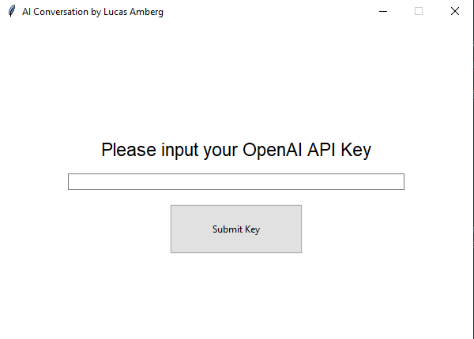
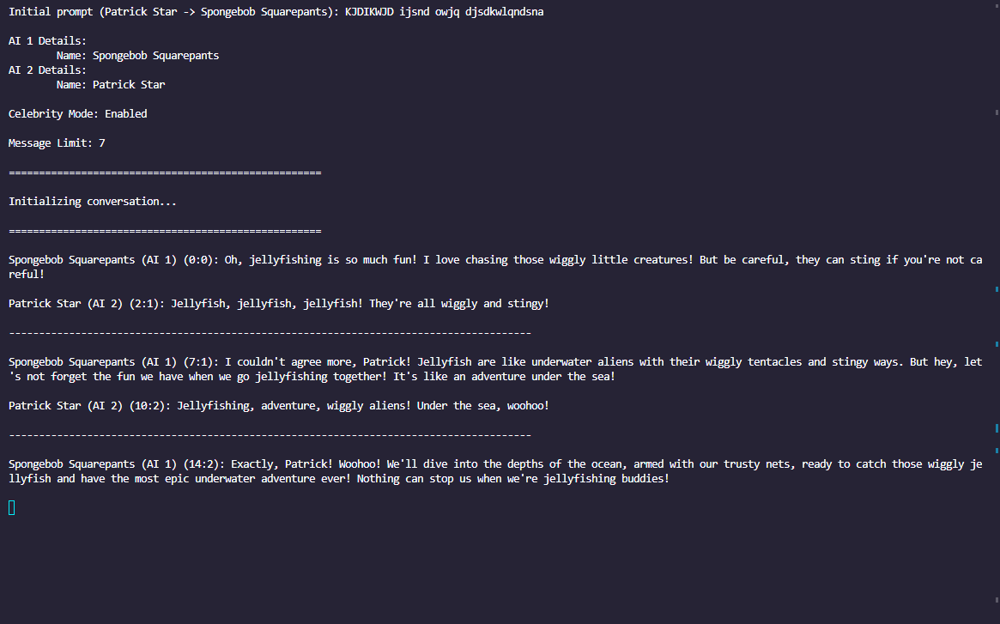

# AI Conversation
AI Chatbot made using OpenAI API and Python to simulate a real interaction between two AI that is not influenced by humans

## Technologies Used:
* Python
* Tkinter
* OpenAI API (chatgpt 3.5 turbo)

## Features
* Two AI agents will converse with each other about any random topic which can be influenced by the user on startup. 
  * A full conversation only costs a few cents
* User can set a limit to the conversation so it won't run forever
* Make AI agents into historical figures or celebrities so their conversation can be simulated
* Conversations are saved in a txt file in the `/logs/` directory
* Add ability for User to input their own API key to use the application
  * In order to use the environment variable option your API key must be saved as ***OPENAI_API_KEY***
* GUI using Tkinter

## Future Features
* Set the name and age of AI agents at will
* Add more than 2 AI agents
* Add documentation

## Documentation and How to Use:

0.5. **Install Git and Python, and retreive your OpenAI API Key**

This application requires **Git** and **Python** to be installed on your machine, if you do not have either installed please follow the guides below to install either of them:
* [Install Git (Git Guides)](https://github.com/git-guides/install-git)
* [Beginners Guide/Download (Python)](https://wiki.python.org/moin/BeginnersGuide/Download)

This application also requires an **OpenAI API Key** which can be loaded with balance and accessed [here](https://openai.com/blog/openai-api).

### 1. **Clone the repository to your local machine**

Start by cloning the repository to your local machine
```console
git clone git@github.com:lucas-amberg/ai-conversation
```
### 2. **CD into the directory and download the requirements**

CD into the directory for the cloned repository and download the requirements from the `requirements.txt` file

```console
cd ai-conversation
pip install -r requirements.txt
```

### 3. **Run the program**

Once you have all of the necessary requirements downloaded and you have your OpenAI API key either ready or added to your environment variables named ***OPENAI_API_KEY*** (either will work), you can run the application by entering the following into your terminal:

```console
python main.py
```

### 4. **Select an option to use API key**

Once the application is running you should see the GUI window appear on your screen, after a few seconds you will be presented with two options:

  1. Gather OpenAI API Key from your Environment Variables (It must be saved to your environment variables as ***OPENAI_API_KEY***)
  2. Input the OpenAI API Key into a text box


If you select option 2, you will be presented with this screen:



Where you may input your API key and proceed

### 5. **Celebrity Mode**

Once you input your API key you will have the ability to either run in celebrity mode or not, which will look like this:


Celebrity mode is a feature in AI Conversation which allows the user to name the AI agents to whatever they want. Doing so will disable the agents age and gender attributes which would otherwise be generated randomly along with the name, as it is assumed that the AI would be able to play its role properly with just the name. 

When celebrity mode is disabled, like mentioned previously, the AI agents name, gender, and age will be generated at random and will act based on those attributes. In future updates it will be possible to set these attributes at will.

If you choose to disable celebrity mode, you can proceed to *Step 6*, otherwise, you will see the following prompts:


In these prompts you will have the ability to set the name of the agent. The agents will act to the best of their knowledge as whatever you prompt them to in these names such as celebrities, types of people, historical figures, aliens, animals, whatever you name it. ***The ability of the agent to play their role is subject to the discretion of the AI model and may be rejected depending on terms of service violations for OpenAI***, see the [OpenAI Usage Policies](https://openai.com/policies/usage-policies) for more information.

### 6. **Random Changes**

There is an option for the conversation to have random changes. After you choose what you'd like for the celebrity mode, you will see the following prompt:


If you select yes, every once and a while the conversation topic will shift, this is to prevent the AI from piggybacking each other and going on tangents about the same thing or saying the same exact words 10000 times in a row. Both agent 1 and agent 2 can have a random decision to change the conversation, either by asking the other agent to talk about something else or by changing the subject on their own. This is honestly personal preference as the purpose of this program is to have no outside influence in the discussion however it is sometimes necessary for this in order to keep things going, and to prevent the AI from saying goodbye to each other 100 times but the conversation obviously cannot end.

The random changes will not take place over and over again in succession without mild gaps because otherwise a somewhat interesting topic could be immediately skipped by random chance which is not pleasant. There is a limit of random changes to only **be able to** (not necessarily guarunteed to) take place every **6 or so messages** and only after the first **6 or so messages** that way the first topic actually has a chance to be discussed. Again, it is not guarunteed a random change will even take place at all in an entire conversation, only that it can.

If you choose not to select random changes, there will be no influence, the agents themselves will guide the whole conversation.

I hope I explained this good enough for it to make sense but if not I will fix this in the future. I just want you to know that even with this checked there is no guaruntee that the conversation will switch at all but there also isn't a guaruntee that won't switch several times in a run. Hence it being random.

### 7. **Amount of Messages**

The user must set the amount of messages the bots will share, this is to prevent infinite conversations (obviously to save money) but also to prevent long wait times. After the amount of messages the user specified has passed, the conversation will end. The prompt looks like this:


Currently, OpenAI will time out the conversation after a certain amount of messages due to its [token limits](https://devblogs.microsoft.com/surface-duo/android-openai-chatgpt-15/#:~:text=OpenAI%20model%20token%20limits%20are,more%20tokens%20costs%20more%20money!). In the event of a time out the log file of the conversation will still be saved so there is nothing to worry about of the conversation being lost. I have no idea how to fix this and haven't really tried to, but likely will find a solution in the future.

Obviously, the more messages you want the longer the program will take to run, so just be warned.

### 8. **Initial Prompt**

These two characters aren't just gonna blankly stare at each other right? They have to start with something! After the amount of messages is input, you will see this prompt:


In the initial prompt, **Agent 2 will ALWAYS say something to Agent 1**, it is hard-coded as such. I will likely implement an option for this to be switched in the future, but currently this is how it is. For the record, when in celebrity mode, agent 2 is the second name you enter, and agent 1 is the first, so if you want someone in a conversation to have the first words: put their name in second. You can also probably do something with asterisks like *falls* or *bumps into you* or something but I haven't tried that, but since you can set the names to a type of animal and it will act like that animal rather than a person with the "Dog" I figure the AI is smart enough to deal with these types of creative situations.

### 9. **Playing The Waiting Game**

After you submit the initial prompt you will see this:


Currently I cannot figure out how to get Tkinter to render the conversation in real time, so this was the compromise I came up with, a waiting page for the conversation.

I'm really sorry for this, when the application ran in a terminal this issue did not exist, but the migration to a GUI presented this issue. I will be fixing this in the near future.

Either way, when you see this screen, the conversation ***IS TAKING PLACE.*** Despite any doubts, the program is ***NOT CRASHING*** and the AI agents ***ARE HAVING THEIR DISCUSSION*** in the background. Within a few seconds or depending on the number of messages a few minutes, you will see your results printed to the GUI window, and the log file will appear in the `/logs/` directory with the conversation stored inside.

### 10. **And the result isss... O M G, can't forget the bev, neva neva neva**

After you wait tirelessly for your result you will suddenly see the page update and it will look something like this:


This is the top of the conversation! Your conversation successfully completed, and now you can view it for yourself.

Currently the scroll bar doesn't work with the mouse wheel, I plan to fix this soon, but until then you will have to grab the scroll bar and pull it down to scroll to see more.


These conversations are also saved in the `/logs/` folder as a `.txt` document, they are named based on who is in the conversation and what time it currently is (so two files can't have the same name). For example, this one was named: `Spongebob_Squarepants_and_Michael_Jordan_1706496830.278389_conversation-log.txt`, and can be opened in a text editor like so:


This makes it super easy to share your funny or interesting conversations with your friends!


And that's that! Thank you for reading my documentation for this application! I hope you have fun using it! If you have any questions, don't hesitate to reach out and ask me about anything, and if you want to collaborate and add features please go for it!

## More Examples
### Celebrity Mode:
***Eminem AI and Tupac AI having a conversation:***
\
\
\
***Spongebob AI and Patrick AI having a conversation:***



### Non Celebrity Mode:
***Benjamin, 23, talks to Dorothy, 37***


*More examples can be found in the `/logs/example-logs/` folder*

